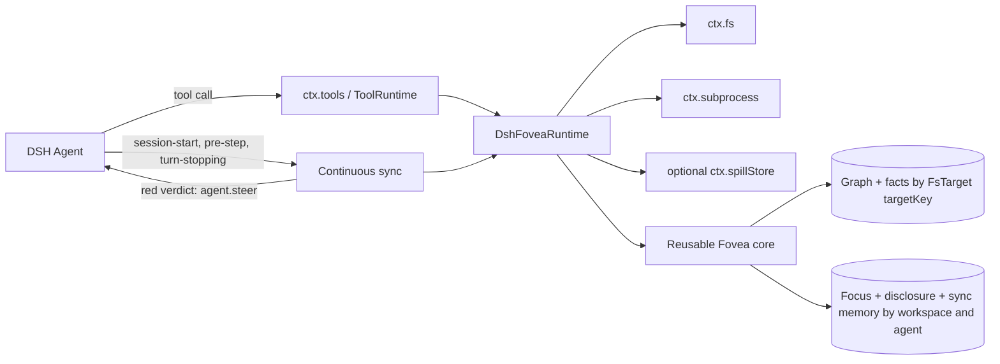

<div align="center">

# 👁️ dsh-fovea

**Foveated repository intelligence for [DeepSeek Harness](https://github.com/deepseek-ai/deepseek-harness)**

_See the whole workspace, sharp where the agent works and cheap everywhere else._

<p>
  
</p>

[](https://github.com/deepseek-ai/deepseek-harness)
[](https://github.com/deepseek-ai/deepseek-harness/blob/main/docs/architecture.md)
[](LICENSE)

</div>

---

**dsh-fovea** adapts [pi-fovea](https://github.com/monotykamary/pi-fovea) into a native DeepSeek Harness plugin and bundle. It compiles a repository into a typed, weighted graph, turns a question or change set into an interest field, diffuses relevance through that graph, and spends a bounded context budget where it matters.

The implementation composes with Harness rather than building a parallel host: DSH owns tools, policy, lifecycle, logs, filesystem access, subprocesses, and optional spills. Fovea adds four repository-intelligence tools, continuous structural drift detection, a slash command, and a runtime skill.

## What it provides

| Surface | Purpose |
| --- | --- |
| `fovea_sketch` | Survey feature basins, routes, hubs, and extraction coverage. |
| `fovea_focus` | Center on a symbol, route, concept, or file and reveal its semantic neighborhood. |
| `fovea_dwell` | Widen the current focus without repeating disclosed periphery. |
| `fovea_impact` | Rank the blast radius and review order of files, symbols, worktree changes, or a base-ref diff. |
| `/fovea` | Human-facing status, reset, sketch, focus, dwell, and impact commands when `ctx.commands` is present. |
| `fovea` skill | Model/user guidance registered when `ctx.skills` is present. |
| Continuous sync | Quiet baselining plus logged steering when repository drift is structurally surprising. |

Every model tool returns one canonical JSON value:

```ts
{ text: string, tokens: number, details: Record<string, JSONValue> }
```

Harness renders `text` to the model while Code Mode and other programmatic callers retain `tokens` and `details`. Fovea does **not** replace native grep or exact file reads: use it to decide where and why, then inspect the selected source precisely.

## Requirements

- Node.js `^22.19.0 || >=24.0.0`
- pnpm `11.20.0` for this checkout
- DeepSeek Harness services pinned to `0.1.0-rc.6`
- Cordis `^4.0.1`
- Git for tracked-file discovery, base-ref impact, and co-change history (plain directories still work)

`@ast-grep/cli` is a runtime dependency. Executable resolution is: `FOVEA_AST_GREP`, then the packaged CLI, then a bare `ast-grep` on the active subprocess provider's `PATH`. A remote subprocess provider cannot execute the host package's binary, so install ast-grep in that execution world or set `FOVEA_AST_GREP` to its provider-visible path.

## Install from this checkout

The safe local installer builds this package, records any prior profile dependency, asks the pinned DSH CLI to add the checkout link, and verifies the composed `dsh-fovea` row. It never starts or restarts DSH.

```bash
# Defaults to the web profile
pnpm run install:local

# Select another profile
pnpm run install:local -- --profile tui

# Reuse already-built artifacts
pnpm run install:local -- --skip-build

# Use a non-default DSH home
DSH_HOME=/path/to/home pnpm run install:local
```

Reload or restart the selected running profile after installation. Verify composition directly with:

```bash
pnpm dlx @monotykamary/dsh@0.1.0-rc.7 --profile web --dump-config
```

Uninstall only the link owned by this checkout and restore the exact previous dependency, if any:

```bash
pnpm run uninstall:local
pnpm run uninstall:local -- --profile tui
```

After an npm release exists, the equivalent profile operation is expected to be:

```bash
pnpm dlx @monotykamary/dsh@0.1.0-rc.7 plugin --profile web add dsh-fovea
```

## Model tool reference

All roots come from the calling agent's session `cwd`; no Fovea tool accepts an arbitrary filesystem root. Tool `max_tokens` values are clamped to `256–16000`.

### `fovea_sketch(max_tokens?)`

Use once near the start of work in an unfamiliar repository. It emphasizes production anchors and structural hubs while collapsing tests and distant regions.

### `fovea_focus(query, max_tokens?, fresh?, path?, language?, kind?)`

`query` may be a symbol, route, concept, or repository-relative file. Optional filters narrow by path, language, or graph-node kind. Set `fresh` to reset disclosure even when the nucleus matches the previous focus.

Supported kinds are `function`, `method`, `class`, `interface`, `type`, `field`, `decl`, `file`, and `anchor`.

### `fovea_dwell(factor?, max_tokens?)`

Widen the current agent-scoped focus. The default diffusion multiplier is `2`; values below `1.2` are raised to `1.2`, and diffusion time is capped internally.

### `fovea_impact(files?, symbols?, include_uncommitted?, base?, max_tokens?)`

Seed a hypothetical or real change and rank consequences with causal paths. With no explicit seeds it includes uncommitted work; supplying `base` computes a `base...HEAD` comparison unless `include_uncommitted` is also requested.

A productive sequence is:

1. `fovea_sketch` for an unfamiliar repository.
2. `fovea_focus` on the most concrete task noun.
3. Native reads/grep on the suggested windows.
4. `fovea_dwell` only if the first neighborhood is too narrow.
5. `fovea_impact` before finishing a cross-file change.

## Human command

When the profile provides `ctx.commands`, dsh-fovea registers:

```text
/fovea status
/fovea reset
/fovea sketch
/fovea focus <query>
/fovea dwell [factor]
/fovea impact [files...]
```

`/fovea <query>` is also a focus shortcut. Command output uses the configured default budget.

## Configuration

The bundle patch inserts one row with id `dsh-fovea`. Override it in the selected profile's `$DSH_HOME/profiles/<profile>/cordis.patch.yml` (or a later `--patch` layer):

```yaml
- id: dsh-fovea
  config:
    defaultBudget: 768
    toolTimeoutMs: 120000
    sync:
      mode: enabled
      scope: session
      budget: 512
      steerThreshold: 0.15
      pushFocus: true
      ackClean: false
      warmMutations: true
```

| Key | Default | Valid values |
| --- | ---: | --- |
| `defaultBudget` | `512` | integer `256–16000` |
| `toolTimeoutMs` | `120000` | integer `1000–2147483647` |
| `sync.mode` | `enabled` | `enabled`, `hidden`, or `disabled` |
| `sync.scope` | `session` | `session` or `repository` |
| `sync.budget` | `512` | integer `128–8192` |
| `sync.steerThreshold` | `0.15` | finite number `0.02–8` |
| `sync.pushFocus` | `true` | boolean |
| `sync.ackClean` | `false` | boolean — tiny "nothing new" ack after a clean structural check |
| `sync.warmMutations` | `true` | boolean |

Unknown configuration keys fail plugin loading. `enabled` emits plugin `notice` messages; `hidden` uses plugin `instructions` messages for the model; `disabled` removes sync and mutation-attribution hooks while keeping explicit tools, command, and skill. The deployment-level `FOVEA_TURN_SYNC=off` (also `0` or `false`) escape hatch always forces disabled mode.

### Advanced environment controls

These are deployment-level tuning controls read when modules load:

| Variable | Default | Range / meaning |
| --- | ---: | --- |
| `FOVEA_AST_GREP` | packaged CLI | Execution-world ast-grep path/name override |
| `FOVEA_TURN_SYNC` | unset | `off`, `0`, or `false` disables continuous sync |
| `FOVEA_MAX_FILES` | `8000` | `100–100000` discovered files |
| `FOVEA_MAX_FILE_BYTES` | `1048576` | `65536–67108864` bytes per source |
| `FOVEA_MAX_ROOTS` | `2` | `1–32` resident workspace graphs |
| `FOVEA_MAX_AGENT_SESSIONS` | `32` | `1–4096` resident agent/session attention states |
| `FOVEA_SPAWN_CONCURRENCY` | `3` | `1–32` concurrent subprocess stages |
| `FOVEA_IO_CONCURRENCY` | `32` | `4–512` concurrent provider I/O operations |
| `FOVEA_MAX_SUBMODULE_DEPTH` | `4` | `1–16` nested repository depth |
| `FOVEA_AST_GREP_CHUNK` | `160` | `32–2048` files per parser chunk |
| `FOVEA_PROBE_TTL_MS` | `1200` | `200–60000` send-path Git probe interval |
| `FOVEA_MEMORY_HALF_LIFE_HOURS` | `48` | `1–8760` surprise-memory half-life |
| `FOVEA_COCHANGE_HALF_LIFE_DAYS` | `30` | `1–3650` co-change half-life |
| `FOVEA_WALK_GAP_MS` | `4000` | `500–300000` plain-root relist gap |
| `FOVEA_SWEEP_GAP_MS` | `20000` | `2000–600000` plain-root full sweep gap |

Invalid integer environment values fall back to the listed default.

## Continuous sync

The lifecycle integration is active unless `sync.mode` is `disabled`:

1. `agent/session-start` begins indexing asynchronously and establishes a quiet content-hash baseline.
2. Successful tools named `write` or `edit` with a string `file_path` receive best-effort before/after hash attribution without replacing those tools.
3. `tools/result` can warm graph refresh and impact math after such mutations.
4. `agent/pre-step` performs a deferred drift check and appends model context only when a prepared red verdict exists.
5. `agent/turn-stopping` performs the full correctness check and calls `agent.steer(...)` only for a red verdict.
6. With `sync.ackClean: true`, a clean structural check outside silent-baseline paths emits one tiny "nothing new" ack — appended like a deferred update so it can never restart an idle agent.
7. Branch checkout generations re-baseline quietly; charged cascades cool over time instead of echoing every turn.

Shell side effects, external editors, and other mutation paths remain `unattributed`. Provenance distinguishes current-session, other-session, mixed, and unattributed transitions when exact hash chains permit it. Current DSH provenance is process-memory scoped, bounded to 2,048 records, and pruned after seven days.

All injected context uses DSH message sources under plugin `dsh-fovea`, so Harness owns transcript durability and presentation.

The math behind the graph, heat kernel, literal bridges, co-change seeding, inferred basins, discovery mode, and the turn-sync surprise gate is documented in [docs/heat-diffusion.md](docs/heat-diffusion.md).

## Architecture and adaptation boundary



| Layer from pi-fovea | dsh-fovea strategy |
| --- | --- |
| Graph types, joins, basins, extraction facts, heat diffusion, ranking, rendering | Reused with minimal algorithmic change. |
| Filesystem discovery, ast-grep, Git, caches, provenance, overflow | Retained behind the `FoveaRuntime` capability seam and DSH providers. |
| Focus, dwell, disclosure, sync baselines, surprise memory | Agent/workspace-scoped rather than root-global. |
| Pi entry point, event names, TUI widgets/settings, hidden-message API, grep takeover | Not reused; replaced by Cordis plugin loading, canonical DSH tools, agent events, command, skill, and system-prompt guidance. |

There is intentionally no browser client plugin: dsh-fovea contributes server/runtime behavior and appears through existing Harness tool, command, skill, and transcript surfaces.

### Execution-world rules

- Repository paths resolve from the calling agent's session `cwd` through `ctx.fs`.
- Provider `FsTarget.targetKey` identifies shared graph/fact state; `ctx.fs.processPath(...)` crosses only into the matching subprocess provider.
- Git and ast-grep run through `ctx.subprocess`, with bounded output, timeout, cancellation, and process-tree ownership.
- DSH cache/provenance entries are bounded in-memory data: 32 MiB per entry and 128 MiB total. They do not survive a DSH process restart.
- The standalone Node adapter uses private temporary-disk cache files instead.
- Complete overflow lists use optional `ctx.spillStore` only for top-level tool calls that carry session/call ownership. Command and sync rendering stays bounded without creating unowned spills.

## Indexing, coverage, and limits

Fovea keeps the graph complete only within its configured indexing envelope; every rendered answer remains token-bounded.

- Default discovery stops at 8,000 supported files.
- Sources over 1 MiB, generated/minified bundles, unreadable files, and parser-failed chunks are omitted or degraded and reported in `details` and `/fovea status`.
- Ignored directories include `.git`, `node_modules`, `dist`, `vendor`, virtual environments, build outputs, coverage, `target`, and common dependency caches.
- Nested repositories/submodules are progressively enrolled when observed work touches them instead of being traversed eagerly.
- Plain non-Git roots use provider directory walks. Git roots additionally gain tracked/untracked discovery, base diffs, and recency-decayed co-change history.
- Repository-owned `.fovea/rules.json` is loaded automatically and extends built-in anchor/file-route rules. Treat repository rule files as trusted project configuration.

The implemented language tiers are:

- Full symbol/call extraction: TypeScript, TSX, JavaScript, Python, Go, and Rust.
- Outline-symbol extraction: Elixir, Ruby, C, C++, Java, Kotlin, Lua, PHP, Swift, Scala, Haskell, and Bash.
- Literal/config joins: YAML, JSON, TOML, env, Terraform/HCL, Markdown, and route conventions including OpenAPI-style paths.

Framework and language coverage is tiered; an empty result is not proof of absence when extraction reports degraded coverage.

### Repository rule example

```json
{
  "rules": [
    {
      "id": "custom-http-route",
      "langs": ["TypeScript"],
      "pattern": "$R.endpoint($P, $$$H)",
      "methods": "^endpoint$",
      "kind": "route"
    }
  ],
  "fileRoutes": [
    {
      "id": "custom-file-route",
      "re": "(?:^|/)endpoints/(.+)\\.ts$",
      "verbs": "suffix",
      "kind": "route"
    }
  ]
}
```

Malformed or invalid entries are ignored and built-in rules remain active.

## Programmatic core API

The `dsh-fovea/core` export supports local Node consumers through the same runtime seam:

```ts
import {
  NodeFoveaRuntime,
  sketch,
  withFoveaRuntime,
} from 'dsh-fovea/core'

const runtime = new NodeFoveaRuntime(process.cwd(), { scopeKey: 'example' })
const result = await withFoveaRuntime(runtime, () =>
  sketch(runtime.processRoot, 512),
)
console.log(result.text)
```

Implementations embedding the engine can provide their own `FoveaRuntime`; operations must always execute inside `withFoveaRuntime(...)`.

## Development and verification

```bash
pnpm install --frozen-lockfile
pnpm run typecheck
pnpm run build
pnpm run test
pnpm run verify

# Complete release gate
pnpm run check

# Dev probe: build stats + anchor coverage for one or more repos
pnpm tsx scripts/probe.ts <repo...>
```

The tests cover core math/rendering/configuration, workspace/agent isolation, real DSH fs and subprocess execution, canonical tool values, optional command/skill registration, lifecycle steering, mutation provenance, and spill behavior. The verifier imports built entry points and checks bundle, exports, artifacts, and Pi-host dependency hygiene.

Pinned baseline: DeepSeek Harness `0.1.0-rc.6`. Harness is in developer preview, so compatibility is reviewed release by release.

## Relationship to the other projects

- [**pi-fovea**](https://github.com/monotykamary/pi-fovea) is the original implementation and source of the graph, diffusion, rendering, and repository-intelligence design.
- [**dsh-fabric**](https://github.com/monotykamary/dsh-fabric) established the out-of-tree DSH bundle and installer conventions followed here.
- [**DeepSeek Harness**](https://github.com/deepseek-ai/deepseek-harness) owns the agent loop, session log, tools, policy, execution providers, and browser shell with which this plugin composes.

## License and acknowledgments

MIT © [Tom Nguyen](https://github.com/monotykamary). See [`LICENSE`](LICENSE) and [`THIRD_PARTY_NOTICES.md`](THIRD_PARTY_NOTICES.md).

Built for DeepSeek Harness, adapted from pi-fovea, with Fovea's original direction inspired by a request from [Alp](https://www.patreon.com/cw/alpderps) for better repository intelligence.
