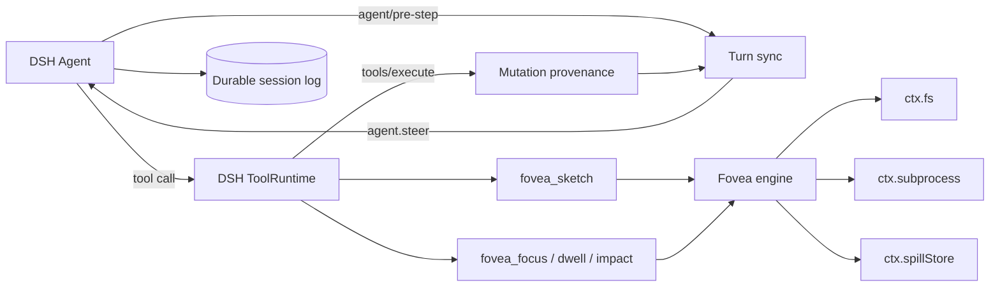

# 👁️ dsh-fovea

**Foveated repository intelligence for [DeepSeek Harness](https://github.com/deepseek-ai/deepseek-harness)**

_See the whole workspace, sharp where the agent works and cheap everywhere else._

  

---

**dsh-fovea** is the DeepSeek Harness adaptation of [pi-fovea](https://github.com/monotykamary/pi-fovea): a token-budgeted repository map built from a cross-language code graph. A question becomes an interest vector, relevance diffuses through the graph as heat, and the renderer spends detail where it matters. Exact symbols stay sharp near the work; distant architecture collapses into a cheap silhouette.

The adaptation is deliberately native to Harness. DSH ToolRuntime remains the tool and policy authority, Cordis owns lifecycle, agent events own proactive context, and the filesystem, subprocess, and spill services keep Fovea inside the active execution world. There is no parallel agent loop or second tool registry.

> [!IMPORTANT]
> **Project status:** design-stage repository. The porting boundary has been audited, but no plugin, package, installer, or usable Fovea tools exist yet. The interfaces and behavior below describe the implementation target; roadmap checkboxes distinguish completed design work from pending code.

## Why Fovea?

Large repositories spend context before the first edit: finding the feature, reconstructing its neighborhood, tracking drift, and estimating blast radius. Fovea turns those jobs into bounded graph queries.

| | Planned capability | What it unlocks |
| :-: | --- | --- |
| 🗺️ | **Repository sketch** | A production-first silhouette without pouring the entire tree into context. |
| 🔎 | **Focused neighborhood** | Exact signatures, typed relationships, and suggested read windows around a symbol, route, or file. |
| 🌡️ | **Progressive dwell** | A semantic zoom that reveals newly relevant neighbors without repeating what the agent already saw. |
| 💥 | **Impact diffusion** | Cross-language review order from changed files, symbols, uncommitted work, or a comparison base. |
| 📡 | **Continuous sync** | Structural drift becomes transparent, logged steering when it is surprising enough to matter. |
| 🎯 | **Hard context budgets** | The graph stays complete while each rendered view fits a caller-selected token budget. |

## Planned model surface

| Tool | Question | Planned answer |
| --- | --- | --- |
| `fovea_sketch` | Where is everything? | Production hubs, route anchors, inferred regions, and collapsed test/fixture structure. |
| `fovea_focus` | What is this? | Exact matches, callers, callees, imports, tests, routes, joins, and suggested source windows. |
| `fovea_dwell` | What else is connected? | Newly lit neighbors from the current agent-scoped focus. |
| `fovea_impact` | What does this change touch? | A ranked cascade with causal channels such as calls, imports, tests, shared literals, and co-change history. |

Each tool will return a DSH canonical JSON value — a bounded text projection plus token and diagnostic metadata — so Native tool calls and Code Mode observe the same validated result. The initial plugin will keep Fovea explicit rather than rewriting Harness's built-in grep result.

## Planned DSH architecture

The bundle is intended to mount as an out-of-tree Cordis plugin in both Web and headless profiles:

- **Tools** register through `ctx.tools.register(defineTool(...))`.
- **Warm context** enters through the `agent/pre-step` waterfall before the request is admitted.
- **Post-turn drift** is checked at `agent/turn-stopping` and continues through `agent.steer(...)` only when the verdict is structurally meaningful.
- **Mutation attribution** wraps `tools/execute`, so direct and Code Mode `edit`/`write` calls share one observation path.
- **Commands and guidance** use `ctx.commands` and `ctx.skills` rather than Pi-specific TUI surfaces.
- **All model-visible sync context is logged.** DSH's transcript remains the source of truth.

## The adaptation boundary

The original engine was already separated from most Pi UI concerns. The port keeps that advantage but does not mistake Node-only code for a portable Harness integration.

| Layer | Strategy |
| --- | --- |
| Graph types, heat diffusion, joins, basins, ranking, rendering logic | Reuse with minimal algorithmic change. |
| Extraction, ast-grep, file discovery, git history, caches, provenance, overflow | Retain behavior behind DSH-aware I/O and cancellation adapters. |
| Focus, dwell, disclosure, sync baselines, charged surprise memory | Move from root-global maps to explicit per-agent, per-workspace state. |
| Pi extension entry point, TUI settings, hidden messages, hybrid grep takeover | Replace with native DSH tools, events, commands, skills, and Cordis configuration. |

The intended core API is instance-based. Repository graphs may be shared by canonical workspace identity; mutable focus and sync state may not be shared between agents merely because their `cwd` matches.

## Continuous sync

The target sync loop preserves Fovea's useful behavior while adopting Harness's turn semantics:

1. `agent/session-start` establishes a quiet content-hash baseline.
2. Successful mutation tools record exact before/after evidence and can warm the next comparison.
3. `agent/pre-step` reuses a warmed verdict when the same turn already owes another model step.
4. `agent/turn-stopping` compares symbols, calls, imports, literals, and anchors once the model otherwise owes no response.
5. Meaningful surprise calls `agent.steer(...)`; clean or previously charged cascades remain silent.

Registered mutation tools can provide provenance evidence. Shell side effects, external editors, and unobserved processes will remain `unattributed` unless stronger evidence exists. A custom `fovea-sync` message source will render as a compact notice. Unlike Pi's optional hidden transcript mode, Harness-visible context will stay durable and inspectable.

## Safety and correctness commitments

- **Workspace-owned roots.** Tool arguments will not accept arbitrary filesystem roots; the calling agent supplies the workspace.
- **Opaque identity.** Cache keys use `FsTarget.targetKey` while subprocesses receive only `ctx.fs.processPath(...)`.
- **One execution world.** Repository reads, ast-grep, and git follow the composed `ctx.fs`/`ctx.subprocess` providers.
- **Cooperative cancellation.** `exec.signal` stops scheduling and terminates owned process trees before a call settles.
- **Lossless JSON.** Tool values contain no `undefined`, non-finite numbers, typed arrays, or host objects.
- **Agent isolation.** Focus depth, disclosed nodes, sync baselines, and surprise memory are scoped to the calling agent.
- **Explicit project trust.** Repository-owned extraction rules remain off until a deployment deliberately enables them.
- **Bounded overflow.** Full views spill through `ctx.spillStore` instead of writing model-facing paths into a shared temporary directory.

## How the map works

In pi-fovea, a repository compiles to a typed graph of files, symbols, routes, imports, calls, tests, inheritance, and normalized literal joins. dsh-fovea is intended to preserve that model: a query becomes a source vector `s` over those nodes, and the field shown to the model is a heat kernel over the symmetric normalized graph Laplacian:

$$
v(t) = e^{-tL} \cdot s \qquad L = I - D^{-1/2} W D^{-1/2}
$$

Different tools observe the same graph at different timescales: sketch is broad, focus is sharp, dwell widens the current focus, and impact diffuses outward from change seeds. A Chebyshev recurrence evaluates the kernel without materializing a dense matrix; cached basis vectors let later timescales reuse the expensive walk.

The source engine currently covers full symbols and calls for **TypeScript, TSX, JavaScript, Python, Go, and Rust**; outline symbols for **Elixir, Ruby, C, C++, Java, Kotlin, Lua, PHP, Swift, Scala, Haskell, and Bash**; and literal joins across **YAML, JSON, TOML, env, Markdown, and OpenAPI**. Preserving that coverage is a porting target, not yet verified DSH compatibility.

See [pi-fovea's heat-diffusion notes](https://github.com/monotykamary/pi-fovea/blob/main/docs/heat-diffusion.md) for the existing algorithm and conductance model that this port will preserve.

## Project status

- [x] Audit pi-fovea's reusable engine and host-specific surface.
- [x] Map Pi lifecycle behavior to DSH tools, agent events, commands, skills, and capability seams.
- [x] Define the multi-agent state and execution-world constraints for the port.
- [ ] Scaffold the Cordis bundle and instance-based engine boundary.
- [ ] Register `fovea_sketch`, `fovea_focus`, `fovea_dwell`, and `fovea_impact`.
- [ ] Port incremental indexing, spill handling, cancellation, and provenance.
- [ ] Port continuous turn sync with durable DSH message attribution.
- [ ] Adapt the existing math, extraction, rendering, workspace, and sync test suites.
- [ ] Publish the first installable release.

Target baseline: Node.js `^22.19.0 || >=24`, pnpm 11, DeepSeek Harness `0.1.0-rc.6`, git, and [ast-grep](https://ast-grep.github.io/) in the active execution world. Because Harness is in developer preview, host compatibility will be pinned and reviewed release by release.

There are intentionally no installation commands yet. The README will add `dsh plugin --profile ... add ...` only after a built bundle and composed-profile verification exist.

## Relationship to the other projects

- [**pi-fovea**](https://github.com/monotykamary/pi-fovea) owns the proven graph, diffusion, rendering, and Pi integration from which this adaptation begins.
- [**dsh-fabric**](https://github.com/monotykamary/dsh-fabric) establishes the pattern: preserve DSH's authority, adapt through documented Cordis seams, and make host-specific limitations explicit.
- [**DeepSeek Harness**](https://github.com/deepseek-ai/deepseek-harness) owns the agent loop, session log, tools, policies, execution providers, and browser surface this plugin composes with.

## Acknowledgments

- Built for [DeepSeek Harness](https://github.com/deepseek-ai/deepseek-harness).
- Adapted from [pi-fovea](https://github.com/monotykamary/pi-fovea).
- Fovea's original direction began with a request from [Alp](https://www.patreon.com/cw/alpderps) for a better repository-intelligence extension.

## License

MIT © [Tom Nguyen](https://github.com/monotykamary). See [`LICENSE`](LICENSE).
